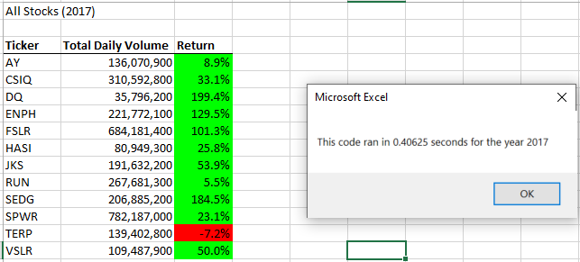
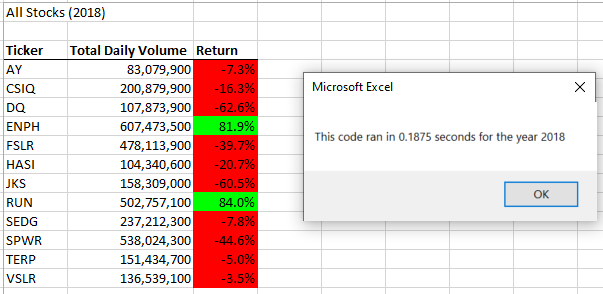
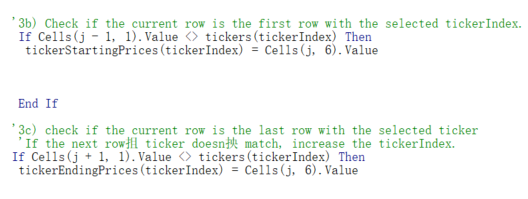

# Stock-Analysis
## Overview of Project
Steve wants to do the stock analysis of the entire stock market, then help his parents to make the investigating decision. In this project, we refactor the Stock Market Dataset with VBA, then compare the run time by refactoing the code with the original code. Generally, we want using less money, less time, and fewer steps of code to help us make the stock investigation decision.
## Results
### Stock Perference
Return in 2017 are much higher than th return in 2018. 11 out of 12 stocks have positive return value in 2017, but only 2 out of 12 stocks have positive return values in 2018.
### Execution Times
Per the image below the code ran in 0.40625 seconds for the year 2017 and 0.1875 econds for the year 2018.

### Code Challenge Analysis

## Summary
### The Advantages vs Disadvantages of refactoring code
Refactoring is to restructure the existing body of code, altering its internal structure, but still keep the external behavior
#### Advantages
- Since each refactoring is small, it's less likely to cause the system get seriously broken after refactoring.
- Refactoring lowers the cost of enhancements.
- Refactoring can reduce unnecessary steps to make it easier for future users to read.
- Refactoring helps finding bugs easily.

#### Disadvantages
- Refactoring have ricks if the existing code doen't have proper test case or the developers don't totally have the big view of the purpose.
- Refactoring can take time if anything wrong during the structure changing.

### The Advantage vs Disvantages of applying to refactoring the original VBA script
